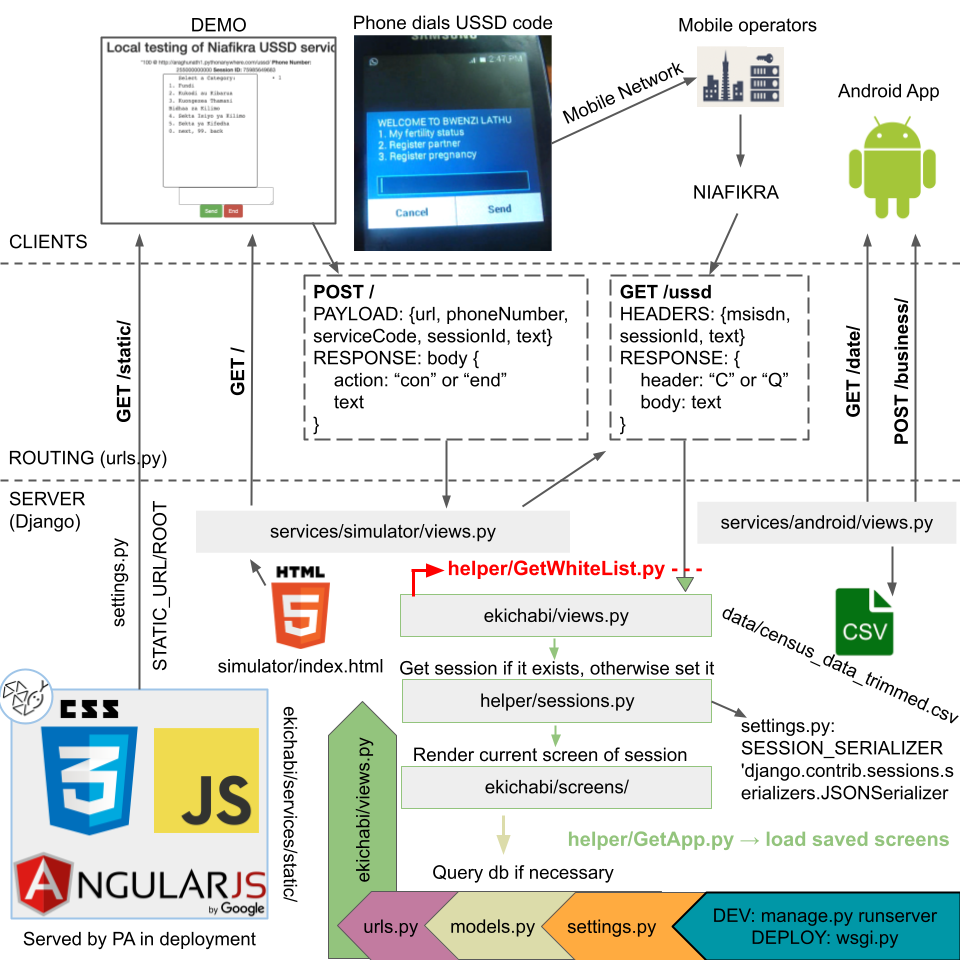

# eKichabi v2
This is a public version of the private repository of the eKichabi v2 project. Sensitive information has been removed. Please contact alexander.le@outlook.dk if you spot any user information/secrets leaked in the code.

The eKichabi v2 paper was published to the ACM SIGCHI 2024 conference in Hawaii. Checkout the paper [here](https://sandergi.github.io/images/eKichabi_v2_chi24a.pdf) and watch the video presentation [here](https://youtu.be/v-1JuQp1ous).

## ekichabi-server
A digital phonebook to connect sustenance farmers in Tanzania. Works via USSD so farmers without an internet connection can use it (via their Telecom). Build with Django in Python.

## ekichabi-app
An Android application for retrieving contact information for enterprises in rural Tanzania. Built in Java 11.0.2 with a minimum Android SDK of 21. We follow a Model-View-ViewModel pattern, with a central Activity, a central ViewModel, and a variety of Fragments and corresponding supporting classes.

## data-analysis
A collection of Jupyter notebooks for analyzing the data collected from the eKichabi v2 user study. The notebooks are written in Python 3.8.5 and use the Pandas library for data manipulation and Matplotlib for data visualization.
