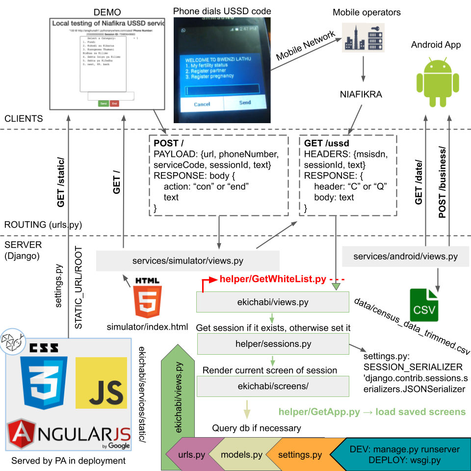

# eKichabi-ussd
A digital phonebook to connect sustenance farmers in Tanzania. Works via USSD so farmers without an internet connection can use it (via their Telecom). Build with Django in Python.



## Setup instructions (tested with MacOS Monterey 12.5)
* Clone branch `git clone -b dev SECRET` or clone the entire repo and `switch` branch
* `mkdir logs` in ekichabi-ussd
* Download Python 3 and set up a virtualenv [optional]
    * https://www.python.org/downloads/ (version SECRET recommended)
    * `pip3 install virtualenv`
    * `which python3` to find path of Python 3 installation
    * create virtualenv: `virtualenv -p {path of python} venv`
    * activate virtualenv: `source venv/bin/activate`
    * to deactivate virtualenv (don't do this now): `deactivate`
* Create MySQL "kichabi" database
    * `brew install mysql` (if you have homebrew, otherwise check out https://dev.mysql.com/doc/refman/5.7/en/macos-installation-pkg.html). I have version SECRET
    * `mysql.server start` (you can stop it later with `mysql.server stop`)
    * run `mysql_secure_installation` to set root password to 123456
        * If your MySQL version recquires a different password, remember to update line 123 in settings.py accordingly:
        ```python
        } if production_env else {
            'default': {
                'ENGINE': 'django.db.backends.mysql',
                'NAME': 'SECRET',
                'USER': 'SECRET',
                'PASSWORD': 'SECRET', # this line
                'HOST': '127.0.0.1',
                'PORT': '3306'
            }
        }
        ```
    * start running mysql: `mysql -uroot -p` (asks for root password)
    * create database: `CREATE DATABASE kichabi;`
    * `exit`
* Install dependencies `pip install -r requirements.txt`
    * this should install django 3.2.10, requests, and mysqlclient
* Set up django with database
    * `python manage.py flush`
    * `python manage.py reset_db ./data/census_data_trimmed.csv`
    * `python manage.py update_whitelist_db`
    * [optional] check database with mysql workbench
* Set up static files if not done already
    * `python manage.py collectstatic`
* Start the development server: `python manage.py runserver`
    * Open http://127.0.0.1:8000/ and everything should be working

### Setup instructions if you already have an old version of the code and database
* Pull the updated code
    * If on another branch: `git checkout -b dev`
    * Then `git pull`
* Install dependencies `pip install -r requirements.txt`
* Update database/screens
    * `python manage.py generate_screens`
* Start the development server: `python manage.py runserver`
    * Open http://127.0.0.1:8000/ and everything should be working

## Management Commands
### Running automated tests
Useful when making changes that are not supposed to change the behavior of the apps (optimizations, refactoring, etc.) and when implementing new features.
* Run all tests: `python manage.py test`
    * This overwrites the saved screens to make sure current code is being tested
    * Takes about a minute to run
* Or run specific tests (faster): `python manage.py test [tests.integration.tests.TestAndroid.test_businessisjson]`
    * Where the stuff in the [] is the dot notation for the specific test and the [] are not included

**Note**: tests are not installed in production. This can be changed in config/settings.py (INSTALLED_APPS)

### Migration
When you change the model in `model.py`, you need to run `python manage.py makemigrations` to
generate the migration file. It's possible that another team member made the migration already
and pushed to Gitlab. In this case, you can feel free to skip this step. 

Next, run `python manage.py migrate` to propogate the model change into your local MySQL database.
    
### Translations
See https://docs.djangoproject.com/en/3.2/topics/i18n/translation/ for details
* To create a translation file in a new language, `python manage.py makemessage -l [REPLACE_WITH_LANGUAGE_CODE]`
    * Then add the language to settings
* To add translations to current languages (Swahili and English), either
    * Modify the translation files in 📂 locale manually
    * Or `python manage.py makemessage --all` to automatically collect strings from source code files
* Use `python manage.py compilemessages` after making changes to translation files

### Clear data and load from csv
* Run `python manage.py flush` to clear all data and admin users
* Run `python manage.py update_whitelist_db` to load the whitelist from the csv
* Run `python manage.py reset_db ./data/census_data_trimmed.csv` to load data from the csv
* Run `python manage.py clearsessions` to clear the sessions (they automatically expire after settings.SESSION_COOKIE_AGE but are not cleared from the database until this command is run -- it should be run as a cron job in deployment)
    - DEPRECATED: We now use redis directly instead of the Django Session abstraction.
* Run `python manage.py generate_screens` to flush the database, reload data + whitelist, and generate the saved screen pickle file

### Runserver
* Run `python manage.py runserver` to spin up a local development server on localhost
* Run `python manage.py runserver --use-old-screens` to do so without generating new screens (faster), also turns off hot reloading
* Run `python manage.py runserver --update-static` to auto collect static files when they change

### Make changes to static files
* Run `python manage.py collectstatic` to make sure individual static files are placed in the static folder that's served by Python Anywhere (and the Django dev server when DEBUG = True)

## Decode Android Logs
* Run `python manage.py decode_android_logs ./logs/Android_*.log` and a decoded file with the .log_decoded extension will be created for each Android log
* Run `python manage.py decode_android_logs [pattern]` and a decoded file with "_decoded" appended to the file extension will be created for each file that matches the pattern

Check 📜 LOGS.md for detailed documentation of the usage logs.

## File overview
Check each file/directory for detailed documentation.
```diff
📦 ekichabi-ussd
 │   📜 README.md
 │   📜 manage.py [+ django program to run management commands +]
 │   📜 requirements.txt [+ python dependencies +]
 │   📜 .gitignore
 │
 └─── 📂 config
 │         📜 settings.py [+ all the configurations for the application +]
 │         📜 urls.py [+ routing for the server +]
 │         📜 wsgi.py [+ specifies how the web server communicates with the application +]
 │   
 └─── 📂 ekichabi [+ main app +]
 │     │   📜 apps.py [+ configure the app +]
 │     │   📜 models.py [+ django ORM so python can interact with the database +]
 │     │   📜 views.py [+ entrypoint for the ussd requests, returns response +]
 │     │
 │     └─── 📂 helper
 │     │        📜 GetApp.py [+ handles loading and saving the screens to /data/saved_screens.pbz2 +]
 │     │        📜 GetWhiteList.py [+ handles loading the whitelist +]
 │     │
 │     └─── 📂 management/commands/ [+ extra manage.py commands +]
 │     │        📜 reset_db.py [+ load database from csv file +]
 │     │
 │     └─── 📂 migrations [+ like commits but for database changes +]
 │     │
 │     └─── 📂 screens [+ all the screen classes that USSD users navigate +]
 │     │
 │     └─── 📂 services
 │           └─── 📂 android [+ integration with the android app +]
 │           │        📜 urls.py [+ routing endpoints for the android app +]
 │           │        📜 views.py [+ handles android requests +]
 │           │
 │           └─── 📂 simulator [+ web application for testing the USSD app +]
 │           │
 │           └─── 📂 static [+ all the static files reside here (silk, simulator, etc.) +]
 │
 └─── 📂 data [+ the data used by the application +]
 │         📜 census_data_trimmed.csv
 │         📜 saved_screens.pbz2 [+ prerendered screens since Python Anywhere is too slow and fails at rendering all these +]
 │
 └─── 📂 locale [+ translations for GNU Gettext +]
 │
 └─── 📂 logs [+ the application logs are stored here, see /ekichabi/helper/Logs.py for details +]
 │
 └─── 📂 resources [+ images and other resources +]
 │
 └─── 📂 scripts
 │     │   📜 export_businesses.py [+ export the business model as csv +]
 │     │   📜 parseLogs.py [+ get average server response time from logs +]
 │     │
 │     └─── 📂 deployment [+ shell scripts to push code to the remote server repo+]
 │ 
 └─── 📂 tests [+ test cases for the application(s) +]
```

## Deployment 

### Intro

* PythonAnywhere is the hosting service for python applications. 
* Currently, our Ekichabi web application is hosted and deployed on PythonAnywhere.
* To login
    * **username**: SECRET
    * **password**: SECRET
* Please **DO NOT** share the username and password to people outside of the team.
* The website is live on http://SECRET.pythonanywhere.com


### Setup (only needs to be done once)

* Make sure you’ve passwordless SSH access to PythonAnywhere (see the [Passwordless login](#passwordless-login) in the section below).

* Make sure you’ve checked out the `pythonAnywhere` branch locally. Run `git checkout pythonAnywhere`. The `pythonAnywhere` branch is only for deployment only, there should **never be any manual changes to this branch**. Use the `dev` branch for all code development. The `pythonAnywhere` branch should be strictly behind or on par with the `dev` branch in terms of the commit history, and changes can always be directly fast-forwarded (there will never be conflicts or merges when pulling)

* Set your `pythonAnywhere` branch to track the `master` branch on the PythonAnywhere server. See the [Set up remote for pythonAnywhere server](#set-up-pythonanywhere-remote) section below.

* Follow the deployment process section below **each time** you want to push to deployment.

### Deployment process

* Make sure there're no unstaged commits locally, and you have switched to the `pythonAnywhere` branch.
    * If not, run `git checkout pythonAnywhere` from your terminal. 

* Sync up the code change from the `dev` branch. Run `git pull origin dev`.

* Run `cd scripts/deployment`

* Run `sh deploy.sh [makemigration, updatewhitelist]`. 
    * The script runs necessary migrations, applies necessary database updates, and rebuilds the project on the remote server. The script will automatically reload the PythonAnywhere website for you. Finally, it pushes all the changes to the remote branch on Gitlab as well. Double check that Gitlab's `pythonAnywhere` branch has the same commit history as the `dev` branch on Gitlab.
    
    * Depending on the nature of the update, you might need to attach options after this command. For example, if you want to update the whitelisted database in deployment, you have to run `sh deploy.sh updatewhitelist`. The `deploy.sh` script has an interactive session that makes sure you have set up everything correctly and are passing in the correct parameters, and it will give you suggestions on what to pass in once you run it. If you are unsure, either consult with another teammate, or run the script directly and closely follows the prompts from the script.

* Pay **close attention to the command outputs** when running the script. The script will most likely finish running even when it encounters an error. Double check with another teammate when there is any outputted error (taking a screenshot of the output is really helpful).
    * If you encounter any errors when running the script, fix them in the `dev` branch, and redo the steps above.

    * Although unlikely, there might be times when you want to rerun the deployment process without making any new commits. If you directly rerun the script, it will not trigger the post-receive script on the remote server since it is already up to date. To get round this, you might want to follow the steps in this [stackoverflow post](https://stackoverflow.com/questions/13677125/force-git-to-run-post-receive-hook-even-if-everything-is-up-to-date).

* At the end, do not forget to do `git checkout dev` to switch back to the development branch.

* You can also update the deployment process by modifying the post-receive scrip through the `gitHook.sh` script. 
    * See the [Update post-receive script section](#update-git-hook-script).


### Set up PythonAnywhere remote

* From your project locally, run `​git remote add pythonanywhere SECRET@ssh.pythonanywhere.com:/home/SECRET/hooks/ekichabi.git`. This adds the path to PythonAnywhere’s bare repo as your git remote. If you are interested in learning more on git hook works, read into this [section](#git-hook). 
 
* Note, if you haven’t set up [passwordless login](#passwordless-login), it might ask you to enter the password. Now you should have two remotes, `origin` for Gitlab, and `pythonanywhere` for the PythonAnywhere server. Verify by running `git remote` on your local terminal.

### Git hook

Git hook is employed to streamline the deployment process. The general workflow is as follows.

* A bare repository is set up on the PythonAnywhere server, you can think of it as a minimal git repository, except that it is not managed by Gitlab or Github, but by yourself. It is under the directory of `~/hooks` on the remote server. You can read more about it in this [article](https://www.saintsjd.com/2011/01/what-is-a-bare-git-repository/).

* The `deploy.sh` script needs to be manually run when changes from deployment branch needs to be pushed to PythonAnywhere. The reason why we can do a `git push` within the script directly is because we have set up the bare repo as a git remote, see the previous section on [Set up remote for PythonAnywhere server](#set-up-pythonanywhere-remote).

* The bare repo receives the code updates in its master branch, and then the post-receive hook is automatically triggered (check out the Git documentation on post-receive [here](https://git-scm.com/docs/githooks#post-receive) if interested). A copy of the post-receive hook script can be found in the githook repo, in a file titled `gitHook.sh`.

* The hook creates the `~/Ekichabi` folder on the pythonAnywhere server, and checks out a copy of the the entire repo to that folder.

* Next, it runs the necessary installation and migration scripts to build the project.

* Finally, the script informs PythonAnywhere server to automatically trigger reload of the Ekichabi website, and it's live with the new update!


 ### Passwordless login

* In order to push code changes to the PythonAnywhere server using the deployment script, setting up passwordless login is highly recommended. Password login allows your local terminal to connect to the remote server on PythonAnywhere without password prompt every single time. Follow this [document](https://help.pythonanywhere.com/pages/SSHAccess/) for setup instructions.

* Once set up successfully, run `ssh SECRET@ssh.pythonanywhere.com` to check. You should have have access to the remote terminal without needing to input the password.


### Update git hook script 

* Deployment workflow might change in the future, and consequently, we need to update the post-receive git hook script as well. 

* The simplest way to update the script is to go on a bash console on the PythonAnywhere and directly connect to the PythonAnywhere server. Then, you can go to `~/hooks/ekichabi.git/hooks/post-receive` and use a text editor (such as vim) to make changes. However, the drawback to that is the lack of clarity to the script to other team members. People wouldn’t be able to know what / if you made any updates to the script, and bugs would be harder to spot.

* To solve that problem and reach more visibility, an exact copy of the post-receive script is copied into your local working repo (note, it’s not the git bare repo). It can be found in `~scripts/deployment/gitHook.sh`. 

* When you want to make updates, you can use your own editor (such as VSCode) to make changes locally in the `dev` branch. In order to propagate that change to PythonAnywhere server, run `bash updateGitHook.sh`. The script adobe simply makes a copy of your local version and overwrites the version on the PythonAnywhere server.

* The invariant is that your local copy at `~scripts/deployment/gitHook.sh` should always be the **same** as the remote post-receive hook (~/hooks/ekichabi.git/hooks/post-receive). Thus, whenever you make any changes to the hook, you **must** run the script.

## Contribute

Check COLLABORATIONS.md for instructions for how to contribute to this project.
